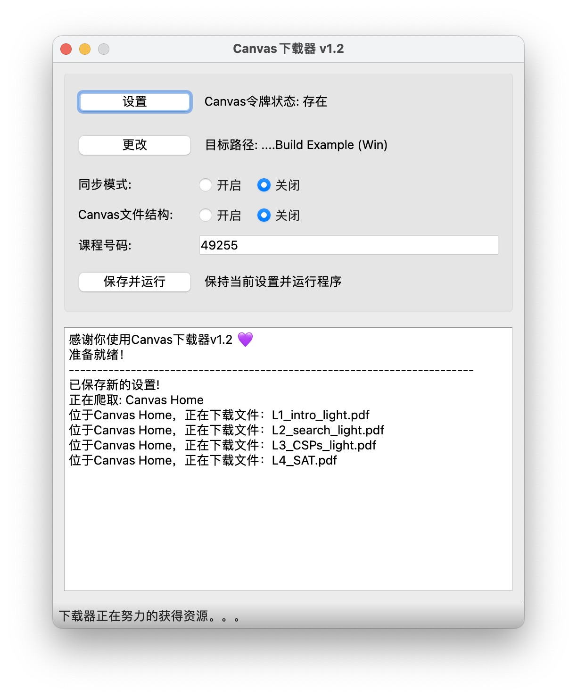
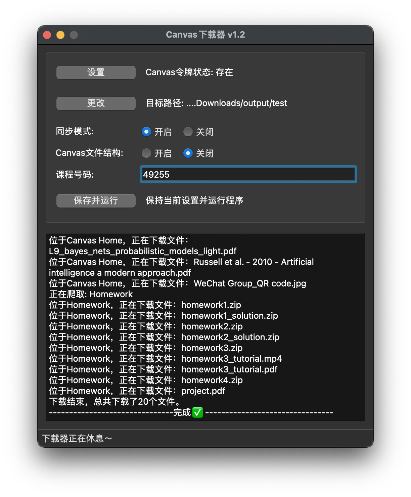

## Canvas下载器演示

|  |  |
|--------------------------------|--------------------------------|

## 以下是面向用户文档

### 下载链接
1. [Window 下载链接](https://github.com/LeeTeng2001/SJTU-Canvas-Downloader/releases/download/v1.2/SJTU.Canvas.exe)
2. [Mac 下载链接](https://github.com/LeeTeng2001/SJTU-Canvas-Downloader/releases/download/v1.2/SJTU.Canvas.dmg)

### 教程
1. 去[Canvas设置](https://oc.sjtu.edu.cn/profile/settings)，滑倒下方找到**允许融入使用的外部软件**，点击创建新访问许可证，用途随便写，过期可以留空白
2. 生成后把你的Canvas令牌保存起来放到一旁
3. 去找你要下载的课程页面，看网址上方最后的号码，抄下来，格式如下：https://oc.sjtu.edu.cn/courses/93214
4. 点击exe程序（应该需要权限），点击set，把你的访问许可证填进去然后点击ok。点击change更改你的目标文件夹。class code填写课程网址代码。
5. **同步模式** : 推荐On因为On只会下载新的文件，他会先检查你的目标文件夹下有没有重名的文件，没有的话才会下载（也会查看目标文件夹的子文件夹所以不要担心）
6. **Canvas文件结构**: 下载的文件要不要依据canvas上的文件夹形式
7. 点击保存并运行
8. 注意Canvas令牌只需要生成，填写一次，以后想要下载其他课程就换课程号码参数就可以了


## 以下是面向开发者文档

## How to build and run this project locally

```bash
# Create new virtual environment and install dependencies
$ python3 -m venv venv
$ source venv/bin/activate
$ pip install -r requirement.txt
 
# Run 
$ python canvas_downloader.py
 
# Build executable and disk (mac)
$ pyinstaller -n "SJTU Canvas下载器" -w --icon=resources/canvas.icns canvas_downloader.py
$ mkdir -p dist/dmg
$ cp -r dist/SJTU\ Canvas下载器.app dist/dmg
$ create-dmg \
  --volname "SJTU Canvas下载器" \
  --volicon "resources/canvas.icns" \
  --window-pos 200 120 \
  --window-size 600 300 \
  --icon-size 100 \
  --icon "SJTU Canvas下载器.app" 175 120 \
  --hide-extension "SJTU Canvas下载器.app" \
  --app-drop-link 425 120 \
  "dist/SJTU Canvas下载器.dmg" \
  "dist/dmg/"
 
# Build executable (window)
$ pyinstaller -n "SJTU Canvas下载器" --onefile -w --icon=resources/canvas.ico canvas_downloader.py
```

## Change Log
- v1.0 
  - Initial build
- v1.1 
  - Added sync & ability to choose download structure
- v1.2 (Current release) 
  - Update to QT6
  - restructure project for maintainability
  - Add docs and code refactoring
  - Remove dependency for `configuration.json` file
  - Use pathlib for path manipulation instead of os
  - Unit testing
  - 更改应用语言为中文

